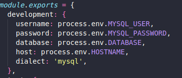

# processo-seletivo-MSB-tecnologia

## Site

https://msb-reactjs-heroku.herokuapp.com/

## Projetos

[backend-msb-tecnologia](https://github.com/thisouzadev/processo-seletivo-MSB-tecnologia-backend)

[frontend-msb-tecnologia](https://github.com/thisouzadev/processo-seletivo-MSB-tecnologia-frontend)

## Navegar no README

- [Sobre o Deploy no FrontEnd](#sobre-o-deploy-no-frontend)
- [Sobre o Deploy no BackEnd](#sobre-o-deploy-no-backend)
- [Material usado para consulta](#material-usado-para-consulta)
## Começando

### Pré-requisitos
<!-- GETTING STARTED -->
1. [heroku](https://www.heroku.com/)
2. [GitHub](github.com)
3. [ClearDB MySQL](https://www.cleardb.com/mysql/)

## Sobre o Deploy no FrontEnd

1. instalei o [express](https://expressjs.com/pt-br/)
2. troquei npm start no package.json para npm run dev
3. coloquei o npm start pra rodar o arquivo server.js onde o heroku vai pegar esse comando e executar o arquivo server.js
4. inseri codigo no arquivo server.js

~~~
const express = require("express");
const { resolve } = require("path");
const app = express();
const listenPort = process.env.PORT || 3000;

app.use("/", express.static(
  resolve(
    __dirname,
    "./build"
  )
));
app.listen(listenPort, () => {
  console.log("server running on port " + listenPort);
});
~~~

5. utilizei os comando git add . e git commit -m "mensagem" e git push para adicionar o arquivo server.js ao git
6. dentro do heroku cliquei no new , depois no create new app , coloquei o nome do app e cliquei em create
7. selecionei o app que eu criei, cliquei no botao "Deploy"
8. conectei o app no meu Github, cliquei no deploy Branch

### Sobre o Deploy no BackEnd

1. Criei o app no heroku e acessei ele.
2. Utilizei o "Resources" fiz uma pesquisa por ClearDB MySQL e cliquei no link do site.
3. Criei um novo banco de dados no ClearDB MySQL

4. Dentro do config vars vai ter a key de conexão com o banco de dados.

<figure>
  <figcaption>5. configurei os env no backend<figcaption>
  
</figure>
    
6. Criar o Procfile e colocar o comando pro heroku dar o start no node.
7. Voltei ao heroku cliquei Reveal Config Vars e inseri as variaveis de ambientes.
8. Cliquei add buildpack e coloquei a opção nodejs.

<figure>
  <figcaption>9. Cliquei em deploy fiz a coneção com meu github e cliquei na opção deploy Branch.<figcaption>
  
</figure>
    
   ## Material usado para consulta
    
   ### [youtube](https://www.youtube.com/watch?v=ZZp0VIjTsbM&ab_channel=Raddy) pro backend
   ### [youtube](https://www.youtube.com/watch?v=S0_WcPP83z8&ab_channel=AlgaWorks) pro frontend 
